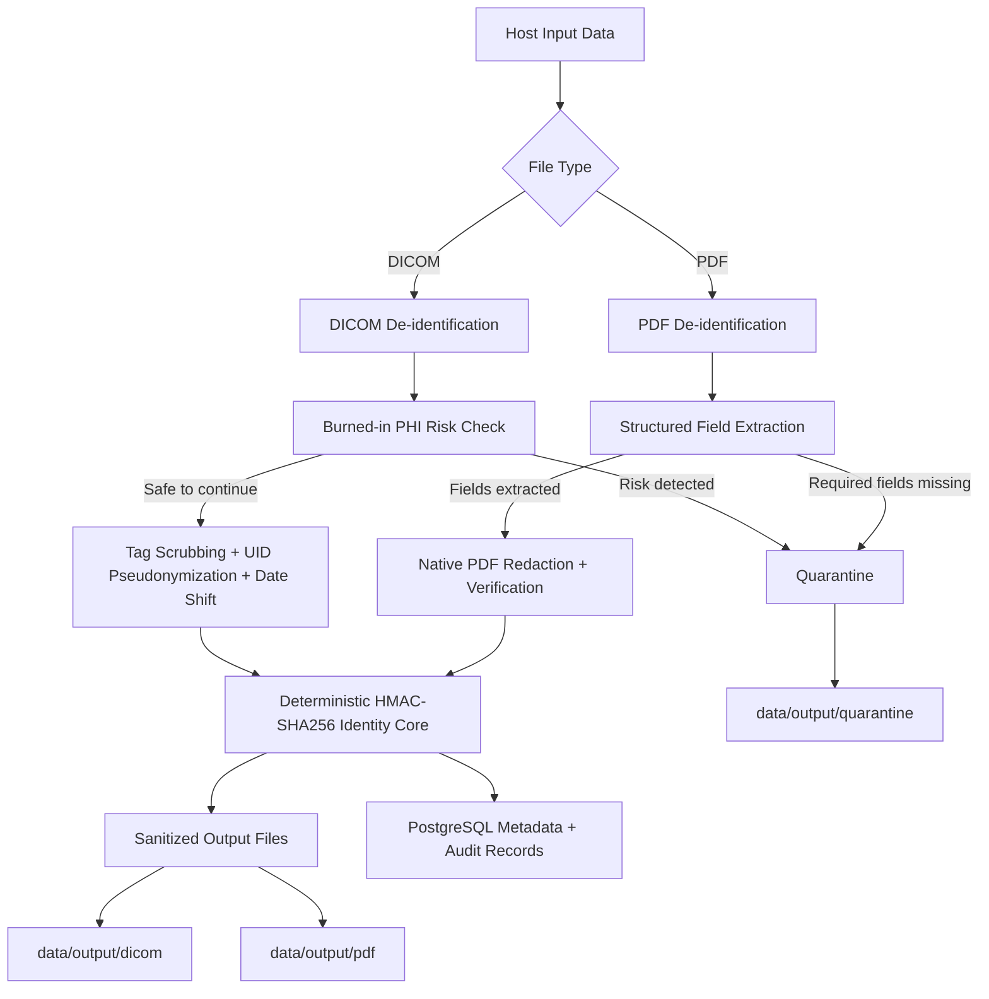
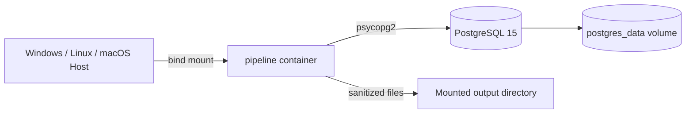
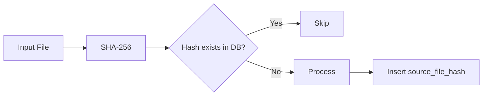

# Healthcare De-identification Pipeline

<p align="center">
  
  
  
  
  
</p>

A containerized batch-processing pipeline for **de-identifying medical DICOM files and clinical PDF reports** while preserving useful non-PHI metadata for downstream analytics.

The pipeline combines deterministic pseudonymization, date shifting, DICOM tag scrubbing, PDF redaction, quarantine handling, SHA-256 based idempotency, concurrent processing, structured logging, and PostgreSQL audit metadata in a reproducible Docker workflow.

> **Important:** This project demonstrates technical de-identification controls. It is **not** a certification of HIPAA, GDPR, or other regulatory compliance. Real clinical deployment requires formal risk assessment, validation, access controls, operational governance, and organization-specific policy review.

---

## Why this project exists

Healthcare datasets are useful for analytics and machine learning, but raw DICOM studies and PDF reports can contain direct patient identifiers.

This project provides a repeatable pipeline that:

- de-identifies supported DICOM metadata;
- redacts known PHI fields from structured PDF reports;
- preserves deterministic patient linkage across supported file types;
- isolates files that cannot be safely processed;
- skips already-processed files using content hashes;
- stores processing metadata and run summaries in PostgreSQL;
- writes sanitized files to mounted local output directories;
- runs the complete workflow through Docker Compose.

---

## Architecture



### Container topology



The `pipeline` container waits for PostgreSQL to become healthy before processing starts.

---

## End-to-end processing flow

```text
Input file
   |
   v
SHA-256 content hash
   |
   v
Already processed?
   |---------------- yes ----------------> SKIP
   |
   no
   v
DICOM / PDF de-identification
   |
   +-------- unsafe / extraction failure --------> QUARANTINE
   |
   v
Generate deterministic sanitized filename
   |
   v
Write sanitized output
   |
   v
Upsert pseudonymous patient metadata
   |
   v
Insert file-level processing record
   |
   v
Record batch summary in pipeline_runs
```

This makes repeated batch executions **idempotent**: files already registered by content hash are skipped instead of being processed again.

---

## Core capabilities

### DICOM de-identification

Implemented in `src/pipeline/dicom_deid.py`.

The current DICOM path includes:

- deterministic HMAC-SHA256 pseudonymization of `PatientID`;
- deterministic replacement of:
  - `StudyInstanceUID`
  - `SeriesInstanceUID`
  - `SOPInstanceUID`
  - `FrameOfReferenceUID`
- synchronization of `MediaStorageSOPInstanceUID` when the SOP Instance UID changes;
- replacement of `PatientName` with `ANONYMOUS`;
- `PatientIdentityRemoved = "YES"`;
- deterministic patient-specific date shifting for:
  - `PatientBirthDate`
  - `StudyDate`
  - `SeriesDate`
- recursive removal of configured direct identifiers from nested DICOM sequences;
- unconditional removal of private/vendor-specific tags;
- extraction of selected non-PHI technical metadata;
- quarantine handling for possible burned-in PHI.

The date offset is deterministic per patient and constrained to:

```text
[-364, +364] days
```

This preserves relative time intervals while obscuring the original calendar dates.

### Burned-in annotation safety gate

The pipeline quarantines DICOMs when:

- `BurnedInAnnotation == YES`, or
- modality is one of the configured higher-risk modalities:
  - `US`
  - `SC`
  - `OT`

These files are copied to the quarantine area without being released as sanitized output.

> The implementation applies a practical subset of DICOM confidentiality controls and marks de-identified datasets appropriately. It should not be interpreted as independently validated full DICOM PS3.15 conformance.

---

## PDF de-identification

Implemented in `src/pipeline/pdf_deid.py`.

The PDF path uses **PyMuPDF** and currently performs:

1. ordered text extraction using `sort=True`;
2. deterministic field parsing against known report labels;
3. extraction of required patient identifiers;
4. identification of additional direct identifiers;
5. native PDF redaction annotations using `search_for()` and `apply_redactions()`;
6. output generation;
7. post-processing verification by reopening the output and checking that targeted PHI values are no longer extractable.

Current fields considered for redaction include values such as:

- Patient ID
- Patient Name
- Ordering Physician
- Contact
- Collection Date
- institution/header text

Selected demographic fields such as gender and patient age may be retained as structured metadata.

If mandatory extraction boundaries such as `Patient ID` or `Patient Name` cannot be identified, the document is **quarantined instead of being passed through**.

> The parser is intentionally deterministic and template-aware. New PDF layouts may require additional parsing rules.

---

## Deterministic pseudonymization

Implemented in `src/pipeline/hashing.py`.

A shared secret salt drives HMAC-SHA256 based transformations across the pipeline.

### Pseudonymous patient ID

```text
Original Patient ID
        |
        v
HMAC-SHA256(secret salt, patient ID)
        |
        v
ANON + first 16 hexadecimal characters
```

Example shape:

```text
ANON0CBAE706C89F5103
```

Using the same secret salt means the same source patient identifier resolves to the same pseudonymous patient identifier across supported files.

### UID derivation

DICOM UIDs are deterministically transformed under a `2.25.` root representation derived from the HMAC digest.

### Deterministic output filenames

Sanitized output names combine:

- pseudonymous patient ID;
- a SHA-256 derived hash of the original path;
- original file extension.

This avoids exposing original patient-facing filenames in sanitized output.

---

## Idempotency and crash-safe re-runs

Before processing each file, the pipeline calculates a SHA-256 content hash.

PostgreSQL stores this value as `source_file_hash` with unique constraints on the DICOM and PDF processing tables.



This provides:

- safe re-runs;
- duplicate detection;
- restart-friendly batch behavior;
- protection against duplicate database records.

---

## PostgreSQL data model

The pipeline initializes its schema automatically.

### `patients`

Stores pseudonymous patient-level metadata:

- `pseudo_patient_id`
- sex
- age
- first-seen timestamp
- last-seen timestamp

### `dicom_files`

Stores DICOM processing information including:

- source file hash
- output filename
- modality
- manufacturer / model
- body part examined
- image dimensions
- pixel spacing
- number of tags removed
- number of identifiers hashed
- number of dates shifted
- quarantine flag
- processing timestamp

### `pdf_reports`

Stores:

- pseudonymous patient ID
- source file hash
- output filename
- redaction verification status
- processing timestamp

### `pipeline_runs`

Captures batch-level observability:

- run type
- start / completion timestamps
- processed count
- skipped count
- quarantined count
- failed count

The database uses a thread-safe PostgreSQL connection pool sized around the configured worker count.

---

## Concurrency and observability

Files are processed through a `ThreadPoolExecutor`.

Default:

```text
MAX_WORKERS=8
```

The pipeline emits structured JSON logs for important lifecycle events, including:

```text
pipeline_starting
Database schema and indexes initialized successfully.
output_dirs_ready
files_discovered
dicom_processed
dicom_quarantined
pdf_processed
pdf_quarantined
dicom_batch_complete
pdf_batch_complete
pipeline_complete
```

File-level exceptions are isolated so one failed file does not terminate the entire batch.

---

## Repository structure

```text
healthcare-deidentification-pipeline/
|
├── src/
│   ├── main.py
│   └── pipeline/
│       ├── __init__.py
│       ├── config.py
│       ├── db.py
│       ├── dicom_deid.py
│       ├── hashing.py
│       ├── logging_setup.py
│       ├── pdf_deid.py
│       └── storage.py
│
├── config/
├── notebooks/
├── scripts/
├── synthetic-phi-generator/
│
├── Dockerfile
├── docker-compose.yml
├── requirements.txt
├── .env.example
├── .gitignore
└── README.md
```

At runtime, Docker Compose additionally expects/creates host-side data paths such as:

```text
pseudo_phi_dicom_data/
data/
└── output/
    ├── dicom/
    ├── pdf/
    └── quarantine/
```

---

## Technology stack

| Component | Technology |
|---|---|
| Runtime | Python 3.11 |
| DICOM processing | pydicom |
| PDF processing | PyMuPDF |
| Database | PostgreSQL 15 |
| PostgreSQL client | psycopg2 |
| Containerization | Docker + Docker Compose |
| Concurrency | `concurrent.futures.ThreadPoolExecutor` |
| Pseudonymization | HMAC-SHA256 |
| File deduplication | SHA-256 |
| Logging | Structured JSON logging |
| Storage | Docker-mounted local filesystem |

---

# Running the project

## Prerequisites

Install:

- Docker Desktop / Docker Engine
- Docker Compose v2
- Git

On Windows, Docker Desktop with the **WSL 2 backend** is a convenient setup.

Verify:

```bash
docker --version
docker compose version
```

---

## 1. Clone the repository

```bash
git clone https://github.com/yuvika-15/healthcare-deidentification-pipeline.git
cd healthcare-deidentification-pipeline
```

---

## 2. Create `.env`

Copy the template:

### Linux / macOS

```bash
cp .env.example .env
```

### Windows PowerShell

```powershell
Copy-Item .env.example .env
```

At minimum, configure:

```ini
DEID_SALT=your_secure_random_secret
DB_PASSWORD=your_database_password

DB_NAME=deid_pipeline
DB_USER=postgres

MAX_WORKERS=8
LOG_LEVEL=INFO
```

Generate a strong salt with OpenSSL:

```bash
openssl rand -hex 32
```

Do **not** commit `.env`.

Docker Compose explicitly configures the internal database hostname as:

```text
db
```

and the pipeline uses the following in-container paths:

```text
/data/input/dicom
/data/input/pdf
/data/output/dicom
/data/output/pdf
/data/output/quarantine
```

---

## 3. Prepare input data

The current `docker-compose.yml` maps these host paths:

| Host path | Container path | Purpose |
|---|---|---|
| `./pseudo_phi_dicom_data` | `/data/input/dicom` | DICOM input |
| `./synthetic-phi-generator/synthetic-phi-generator/data/input/pdf` | `/data/input/pdf` | PDF input |
| `./data/output` | `/data/output` | sanitized output + quarantine |

Create the DICOM input and output directories if needed.

### Linux / macOS

```bash
mkdir -p pseudo_phi_dicom_data
mkdir -p data/output
```

### Windows PowerShell

```powershell
New-Item -ItemType Directory -Force pseudo_phi_dicom_data
New-Item -ItemType Directory -Force data\output
```

Place test DICOM files under:

```text
pseudo_phi_dicom_data/
```

Place test PDF reports under:

```text
synthetic-phi-generator/synthetic-phi-generator/data/input/pdf/
```

---

## 4. Build and run

First run or after dependency / Dockerfile changes:

```bash
docker compose up --build
```

For subsequent runs when only input files or mounted paths have changed:

```bash
docker compose up
```

The expected lifecycle is:

```text
PostgreSQL becomes healthy
        ↓
Database schema/indexes initialize
        ↓
Output directories initialize
        ↓
Input files are discovered
        ↓
DICOM batch executes
        ↓
PDF batch executes
        ↓
Run summaries are written
        ↓
pipeline container exits with code 0
```

A successful batch runner is expected to exit after processing is complete. PostgreSQL may remain running because its service uses `restart: unless-stopped`.

Stop the stack with:

```bash
docker compose down
```

---

# Outputs

Sanitized files are written to:

```text
data/output/dicom/
data/output/pdf/
```

Quarantined files are written under:

```text
data/output/quarantine/dicom/
data/output/quarantine/pdf/
```

The original input mounts are read-only inside the pipeline container.

---

# Verification / Evidence

The project is designed so its behavior can be verified directly rather than inferred from console messages alone.

## 1. Verify output files

### Linux / macOS

```bash
find data/output -type f
```

### PowerShell

```powershell
Get-ChildItem -Recurse .\data\output
```

---

## 2. Inspect batch audit records

```bash
docker compose exec db psql -U postgres -d deid_pipeline \
  -c "SELECT * FROM pipeline_runs ORDER BY run_id DESC;"
```

---

## 3. Inspect pseudonymous patients

```bash
docker compose exec db psql -U postgres -d deid_pipeline \
  -c "SELECT * FROM patients ORDER BY last_seen_at DESC LIMIT 10;"
```

---

## 4. Inspect DICOM processing statistics

```bash
docker compose exec db psql -U postgres -d deid_pipeline \
  -c "SELECT modality, manufacturer, COUNT(*) FROM dicom_files GROUP BY modality, manufacturer;"
```

---

## 5. Inspect PDF redaction verification

```bash
docker compose exec db psql -U postgres -d deid_pipeline \
  -c "SELECT redaction_verified, COUNT(*) FROM pdf_reports GROUP BY redaction_verified;"
```

---

## 6. Demonstrate idempotency

Run the same batch twice:

```bash
docker compose up
```

On the second execution, files whose content hashes already exist in PostgreSQL should be counted as **skipped** rather than processed again.

This provides a simple reproducible demonstration that duplicate processing is prevented.

---

## 7. Demonstrate quarantine behavior

Files may enter quarantine when, for example:

- a DICOM has `BurnedInAnnotation = YES`;
- a DICOM uses a configured high-risk modality;
- a PDF is missing required extraction fields.

The originals are isolated for manual review rather than being silently released as sanitized assets.

---

## Example structured log flow

A normal run should include events similar to:

```json
{"level":"INFO","logger":"pipeline.main","message":"pipeline_starting"}
{"level":"INFO","logger":"pipeline.db","message":"Database schema and indexes initialized successfully."}
{"level":"INFO","logger":"pipeline.storage","message":"output_dirs_ready"}
{"level":"INFO","logger":"pipeline.main","message":"files_discovered"}
{"level":"INFO","logger":"pipeline.main","message":"dicom_batch_complete"}
{"level":"INFO","logger":"pipeline.main","message":"pdf_batch_complete"}
{"level":"INFO","logger":"pipeline.main","message":"pipeline_complete"}
```

Counts depend on the input dataset used for that run.

---

# Configuration reference

The application reads configuration from environment variables.

| Variable | Purpose | Effective Docker value/default |
|---|---|---|
| `DEID_SALT` | HMAC secret used for pseudonymization and date offsets | required |
| `DB_HOST` | PostgreSQL service hostname | `db` via Compose |
| `DB_PORT` | PostgreSQL port | `5432` |
| `DB_NAME` | database name | `deid_pipeline` |
| `DB_USER` | database user | `postgres` |
| `DB_PASSWORD` | database password | required |
| `DICOM_INPUT_DIR` | DICOM input inside container | `/data/input/dicom` |
| `PDF_INPUT_DIR` | PDF input inside container | `/data/input/pdf` |
| `DICOM_OUTPUT_DIR` | DICOM output inside container | `/data/output/dicom` |
| `PDF_OUTPUT_DIR` | PDF output inside container | `/data/output/pdf` |
| `QUARANTINE_DIR` | quarantine root | `/data/output/quarantine` |
| `MAX_WORKERS` | thread pool size | `8` |
| `LOG_LEVEL` | log threshold | `INFO` |
| `UPLOAD_MAX_RETRIES` | output copy retry count | `3` in application config |
| `UPLOAD_RETRY_BACKOFF` | initial retry backoff in seconds | `2.0` in application config |

---

# Design decisions and trade-offs

## Deterministic pseudonymization vs random identifiers

**Decision:** HMAC-SHA256 keyed pseudonymization.

**Why:** The same patient can remain linkable across supported files without storing the original identifier in a central mapping table.

**Trade-off:** The secret salt becomes security-sensitive and must be protected.

---

## Date shifting vs deleting all dates

**Decision:** Apply a deterministic patient-specific offset.

**Why:** Relative clinical intervals remain useful for longitudinal analysis.

**Trade-off:** Date shifting is only one component of a complete re-identification risk strategy.

---

## Strict quarantine vs best-effort output

**Decision:** Quarantine inputs when the pipeline cannot establish sufficient confidence to continue.

**Why:** It is safer to require manual review than to silently release a potentially unsafe artifact.

**Trade-off:** Some legitimate files require additional parser or modality-specific support.

---

## Deterministic PDF parsing vs generic NER

**Decision:** Use known labels and visual text ordering.

**Why:** It is transparent, inexpensive, reproducible, and well-suited to known synthetic/report templates.

**Trade-off:** Generalization to unseen report structures is limited and requires additional parsing logic.

---

## PostgreSQL idempotency vs an in-memory manifest

**Decision:** Persist source hashes and run metadata in PostgreSQL.

**Why:** Processing state survives application restarts and can be queried or audited.

**Trade-off:** Each file requires database interaction.

---

# Security considerations

- Never commit `.env`, cryptographic salts, credentials, or real PHI.
- Keep the HMAC salt stable only when deterministic linkage is required.
- Rotating the salt changes generated pseudonymous identifiers.
- Input mounts are read-only in Docker Compose.
- Quarantined assets should still be treated as sensitive because they may contain PHI.
- PostgreSQL metadata is pseudonymous, not automatically anonymous.
- Output verification should be extended for each production document template and imaging modality.
- Real-world deployment should include authorization, encryption at rest/in transit, secret management, access logging, retention policies, and independent de-identification validation.

---

# Current limitations

This repository intentionally does **not** claim to solve every de-identification problem.

Current limitations include:

- PDF extraction is template/label dependent.
- Image-based/scanned PDFs require OCR or another image-aware workflow.
- Burned-in pixel PHI is detected conservatively through tags/modality rules; pixel-level text detection is not implemented here.
- DICOM confidentiality requirements are broader than the subset implemented by this project.
- Real PHI should not be used without appropriate governance and security controls.
- No performance benchmark is published yet; throughput depends on host hardware, file mix, storage, PostgreSQL performance, and `MAX_WORKERS`.

Being explicit about these limitations is intentional: the project favors **auditable behavior and fail-safe quarantine over unsupported claims**.

---

# Suggested portfolio evidence

For a stronger GitHub presentation, future screenshots can be committed under `docs/assets/` and referenced here.

Useful evidence includes:

1. Docker Desktop showing `db` healthy and the pipeline completing successfully.
2. Terminal output showing non-zero `files_discovered`.
3. A PostgreSQL `pipeline_runs` query showing processed/skipped/quarantined counts.
4. A safe synthetic PDF before/after redaction comparison.
5. Sanitized DICOM metadata printed before/after using a synthetic DICOM fixture.
6. A second run showing duplicate files counted as `skipped`.

Only **synthetic data** should be used in public screenshots.

---

# Clean reset

Stop containers:

```bash
docker compose down
```

Stop containers and remove the persistent PostgreSQL volume:

```bash
docker compose down -v
```

> `down -v` deletes the PostgreSQL volume and therefore removes stored processing/audit state.

---

# Future improvements

Potential extensions include:

- OCR-based PHI detection for scanned/image PDFs;
- pixel-level burned-in text detection for DICOM images;
- configurable DICOM de-identification profiles;
- automated integration tests with synthetic fixtures;
- GitHub Actions CI;
- object-storage adapters for S3 / Azure Blob / GCS;
- metrics export and operational dashboards;
- configurable PDF templates / NER-assisted fallback;
- benchmark suite for throughput and memory use.

---

## Project focus

This project is designed to demonstrate practical engineering around:

**medical data processing · privacy-aware pipelines · DICOM · PDF redaction · deterministic pseudonymization · PostgreSQL · Docker · concurrency · idempotency · observability · fail-safe quarantine**
